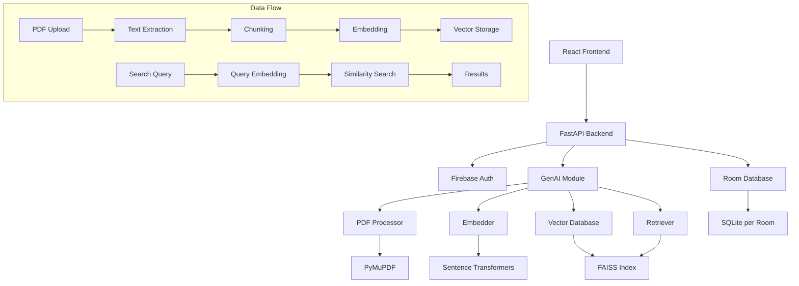
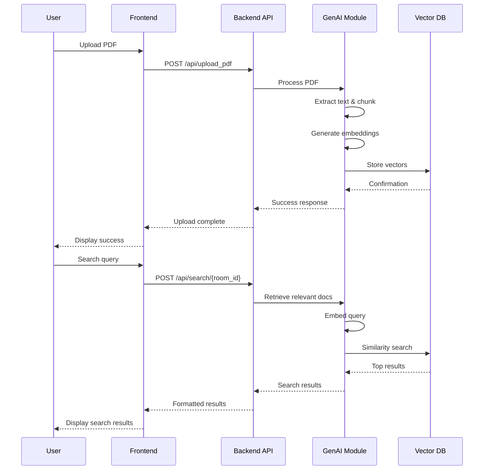

# SummAIze: AI-Powered Research Collaboration Platform

## Overview

SummAIze is an innovative research collaboration platform that leverages Generative AI to enhance document analysis and retrieval for academic and professional research teams. The platform enables users to create collaborative "rooms" where they can upload PDF documents, index them into vector databases, and perform semantic searches to quickly find relevant information across their research materials.

The system consists of three main components:
- **Frontend**: A React-based web application for user interaction
- **Backend API**: A FastAPI-powered REST API handling authentication, data processing, and AI workflows
- **GenAI Module**: A Python module for PDF processing, vector embeddings, and semantic retrieval

## Features

- **Room-based Collaboration**: Create private research rooms for team collaboration
- **PDF Upload & Processing**: Upload research papers and documents to be indexed
- **Semantic Search**: Perform intelligent searches across all uploaded documents using vector similarity
- **Firebase Authentication**: Secure user authentication and authorization
- **Real-time Updates**: Live synchronization of room activities
- **Responsive Design**: Modern, mobile-friendly user interface

## Project Structure

```
ai-with-frontend/
├── api/                          # Backend API (FastAPI)
│   ├── app/
│   │   ├── main.py              # FastAPI application entry point
│   │   ├── api/
│   │   │   ├── routes.py        # API endpoints for PDF upload and search
│   │   │   └── services/
│   │   │       ├── pdf_loader.py # PDF download utilities
│   │   │       └── room_db.py   # Room-specific database management
│   │   └── models/
│   │       └── schemas.py       # Pydantic data models
│   ├── requirements.txt         # Python dependencies
│   └── readme.md               # API-specific documentation
├── frontend/                     # React Frontend
│   ├── public/
│   │   └── index.html          # Main HTML template
│   ├── src/
│   │   ├── App.tsx             # Main application component
│   │   ├── index.tsx           # React entry point
│   │   ├── components/         # Reusable UI components
│   │   │   ├── Button.tsx
│   │   │   ├── MessageShare.tsx
│   │   │   ├── Popup.tsx
│   │   │   ├── RoomCode.tsx
│   │   │   └── Prompt/
│   │   ├── contexts/
│   │   │   └── AuthContext.tsx # Authentication context
│   │   ├── hooks/
│   │   │   ├── useAuth.ts      # Authentication hook
│   │   │   └── useRoom.ts      # Room management hook
│   │   ├── pages/              # Main application pages
│   │   │   ├── AdminRoom.tsx
│   │   │   ├── Home.tsx
│   │   │   ├── NewRoom.tsx
│   │   │   └── Room.tsx
│   │   ├── services/
│   │   │   └── firebase.ts     # Firebase configuration
│   │   └── styles/             # SCSS stylesheets
│   ├── package.json            # Node.js dependencies and scripts
│   ├── tsconfig.json           # TypeScript configuration
│   └── README.md               # Frontend-specific documentation
└── genai/                       # AI Processing Module
    ├── __init__.py
    ├── main.py                 # Main AI service functions
    ├── baseline_retriever.py   # Semantic search implementation
    ├── data_manager.py         # PDF indexing and data management
    ├── embedder.py            # Text embedding utilities
    ├── requirements.txt       # Python dependencies
    └── data/
        └── pdfs/               # PDF storage directory
```

### Directory Explanations

- **`api/`**: Contains the FastAPI backend that handles HTTP requests, authentication, and orchestrates AI workflows
- **`frontend/`**: React TypeScript application providing the user interface for room creation, PDF uploads, and search
- **`genai/`**: Core AI module responsible for PDF text extraction, vector embeddings, and semantic retrieval using similarity search

## Technologies Used

### Backend
- **Python 3.8+**
- **FastAPI**: Modern, fast web framework for building APIs
- **Pydantic**: Data validation and serialization
- **SQLite**: Local database for vector storage (room-specific)
- **Firebase Admin SDK**: Server-side Firebase integration

### Frontend
- **React 18**: UI library for building user interfaces
- **TypeScript**: Typed JavaScript for better development experience
- **React Router**: Client-side routing
- **Firebase SDK**: Client-side Firebase integration for authentication
- **SCSS**: Styling with Sass preprocessor
- **React Icons**: Icon library

### AI & Data Processing
- **Sentence Transformers**: For generating text embeddings
- **FAISS**: Efficient similarity search and vector indexing
- **PyMuPDF (Fitz)**: PDF text extraction
- **NumPy**: Numerical computing
- **Pandas**: Data manipulation

## Installation and Setup

### Prerequisites
- Python 3.8 or higher
- Node.js 16 or higher
- npm or yarn package manager
- Firebase project with Authentication and Storage enabled

### Backend Setup

1. **Navigate to the API directory:**
   ```bash
   cd api
   ```

2. **Create a virtual environment:**
   ```bash
   python -m venv venv
   # On Windows:
   venv\Scripts\activate
   # On macOS/Linux:
   source venv/bin/activate
   ```

3. **Install dependencies:**
   ```bash
   pip install -r requirements.txt
   ```

4. **Configure environment variables:**
   Create a `.env` file in the `api/` directory with your Firebase credentials:
   ```
   FIREBASE_CREDENTIALS_PATH=path/to/your/firebase-credentials.json
   ```

5. **Start the development server:**
   ```bash
   uvicorn app.main:app --reload
   ```

   The API will be available at `http://localhost:8000`

### Frontend Setup

1. **Navigate to the frontend directory:**
   ```bash
   cd frontend
   ```

2. **Install dependencies:**
   ```bash
   npm install
   ```

3. **Configure Firebase:**
   Create a `.env` file in the `frontend/` directory:
   ```
   REACT_APP_API_KEY=your_firebase_api_key
   REACT_APP_AUTH_DOMAIN=your_project.firebaseapp.com
   REACT_APP_DATABASE_URL=https://your_project.firebaseio.com
   REACT_APP_PROJECT_ID=your_project_id
   REACT_APP_STORAGE_BUCKET=your_project.appspot.com
   REACT_APP_MESSAGING_SENDER_ID=your_sender_id
   REACT_APP_APP_ID=your_app_id
   ```

4. **Start the development server:**
   ```bash
   npm start
   ```

   The frontend will be available at `http://localhost:3000`

### AI Module Setup

The GenAI module dependencies are included in the API requirements. Ensure the virtual environment is activated when running the API.

## Usage Examples

### 1. Creating a Research Room
1. Log in using Firebase Authentication
2. Click "Create New Room" on the home page
3. Enter a room name and description
4. Share the generated room code with collaborators

### 2. Uploading Research Papers
1. Enter a room using the room code
2. Click "Upload PDF" in the room interface
3. Select a PDF file from your device
4. Add title, researcher name, and optional description
5. The system will process and index the document

### 3. Performing Semantic Search
1. In the room interface, enter a search query
2. Click "Search" to perform semantic retrieval
3. View relevant excerpts from uploaded documents
4. Results are ranked by relevance to your query

### API Usage Example

**Upload PDF:**
```bash
curl -X POST "http://localhost:8000/api/upload_pdf" \
  -H "Content-Type: application/json" \
  -d '{
    "roomId": "room123",
    "fileURL": "https://storage.googleapis.com/bucket/paper.pdf",
    "title": "Machine Learning Advances",
    "researcher": "Dr. Smith"
  }'
```

**Search Documents:**
```bash
curl -X POST "http://localhost:8000/api/search/room123" \
  -H "Content-Type: application/json" \
  -d '{
    "query": "neural network architectures",
    "threshold": 0.5
  }'
```

## Architecture Diagrams

### System Architecture



### Data Flow Diagram



## Contributing

1. Fork the repository
2. Create a feature branch (`git checkout -b feature/amazing-feature`)
3. Commit your changes (`git commit -m 'Add amazing feature'`)
4. Push to the branch (`git push origin feature/amazing-feature`)
5. Open a Pull Request

## License

This project is licensed under the MIT License - see the LICENSE file for details.

## Acknowledgments

- Built with FastAPI, React, and modern AI libraries
- Firebase for authentication and storage
- Open-source community for invaluable tools and libraries